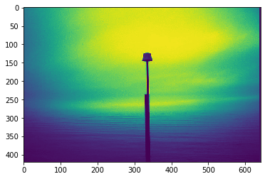
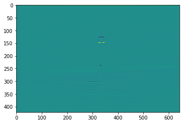

```python
import keras
from keras.datasets import mnist
import matplotlib.pyplot as plt
import numpy as np
from scipy.signal import convolve2d
import cv2
```


```python
pip install pillow
```

    Collecting pillow
    [?25l  Downloading https://files.pythonhosted.org/packages/8f/f3/c6d351d7e582e4f2ef4343c9be1f0472cb249fb69695e68631e337f4b6e9/Pillow-6.1.0-cp37-cp37m-macosx_10_6_intel.macosx_10_9_intel.macosx_10_9_x86_64.macosx_10_10_intel.macosx_10_10_x86_64.whl (3.8MB)
         |████████████████████████████████| 3.9MB 929kB/s eta 0:00:01
    [?25hInstalling collected packages: pillow
    Successfully installed pillow-6.1.0
    WARNING: You are using pip version 19.2.2, however version 19.2.3 is available.
    You should consider upgrading via the 'pip install --upgrade pip' command.
    Note: you may need to restart the kernel to use updated packages.


```python
(x_train, y_train), (x_test, y_test) = mnist.load_data()
```


```python
x_train[0].shape
```


```python
plt.imshow(x_train[4], cmap = 'gray')
print(x_train[4].shape)
```


```python
horizontal_filter = np.array([[1, 1, 1],
                  [0, 0 , 0],
                  [-1, -1 , -1]])
horizontal_filter.shape
```


    (3, 3)


```python
convolved_ = convolve2d(x_train[4],horizontal_filter ,mode = 'valid')
```


```python
plt.imshow(convolved, cmap = 'gray')
print(convolved.shape)
```


```python
ver_filter = np.array([[1, 0, -1],
                      [1, 0 ,-1],
                      [1, 0, -1]])
```


```python
convolved_ver = convolve2d(x_train[4],ver_filter, mode = 'valid')
```


```python
plt.imshow(convolved_ver, cmap='gray')
```


```python
img = cv2.imread('pole.png',0)
narr = np.array(img)
plt.imshow(img)
con = convolve2d(img, horizontal_filter)
```





```python
plt.imshow(con)

```


    <matplotlib.image.AxesImage at 0x132511cf8>





```python

```
